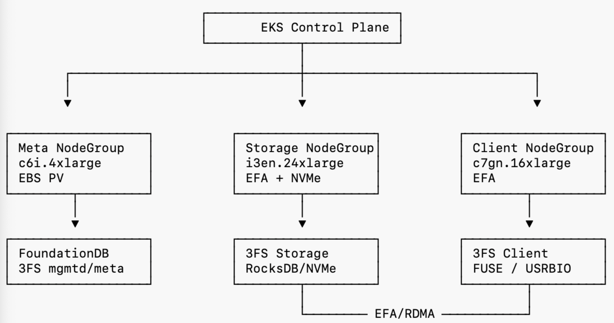

# FlatWall Private Cloud Storage Layer
I built the initial storage layer for FlatWall **Private Cloud**, my private AI/Quant research platform. The core idea is a disaggregated, **3FS**-based architecture on **AWS EKS**, featuring **EFA**-enabled networking, NVMe-backed storage nodes, and **FoundationDB** for metadata. The benchmark suite is designed to compare Local NVMe, raw EFA, FUSE, USRBIO, checkpointing, metadata-heavy workloads, scaling, and KVCache-like read/GC pressure. 

## 🔴 **Ultimate Performance**
In the performance profile, USRBIO reaches 18–22 GiB/s large-block read throughput and 14–18 GiB/s write throughput, delivering 2–3× higher throughput and 3–4× lower P99 latency than the FUSE compatibility path. The system also achieves approximately 6–8 seconds for a 128 GiB checkpoint publish, 25k–35k metadata stat operations per second, and 12–16 GiB/s KVCache-like read throughput.

| Workload | Metric | Result | vs FUSE |
| :--- | :--- | :--- | :--- |
| **USRBIO Large-block Read** | Throughput | 18–22 GiB/s | 2–3× higher |
| **USRBIO Large-block Write** | Throughput | 14–18 GiB/s | 2–3× higher |
| **USRBIO Read** | P99 Latency | < 5 ms | 3–4× lower |
| **FUSE Read** | P99 Latency | 15–20 ms | Baseline |
| **Checkpoint Publish** | 128 GiB write | 6–8 sec | — |
| **Metadata Stat** | Ops/s | 25k–35k | — |
| **Metadata Create** | Ops/s | 8k–12k | — |
| **Client Scaling (2→4)** | Linearity | >85% | — |
| **KVCache-like Read** | Throughput | 12–16 GiB/s | — |
| **KVCache GC** | Peak IOPS | 500k–1M | — |

## 1. Project Background
FlatWall is an expert-agent-driven research platform purpose‑built for quantitative trading research. Developed by me, it transforms how trading ideas become systematic strategies by placing expert agents at the core of the workflow. It helps trading enthusiasts and researchers:
- structure trading ideas;
- run reproducible experiments;
- validate signals rigorously;
- compare research paths;
- review portfolio construction;
- analyze execution feedback;
- turn raw ideas into measurable research and trading workflows.
  
FlatWall is not just a chat interface. It is designed as a private-cloud research platform where agents, tools, datasets, experiments, backtests, portfolios, execution logs, and feedback loops are orchestrated together.

## Why Fire-Flyer File System (3FS)

3FS is a high-performance distributed file system designed for AI training and inference workloads.

- Disaggregated Architecture – Separates metadata (stateless), storage (data plane), and client access. Each layer scales independently, avoiding coordination bottlenecks common in monolithic file systems.

- Strong Consistency (CRAQ) – Implements Chain Replication with Apportioned Queries. Provides strong consistency while allowing read scale-out from any replica. No stale reads, no partial writes.

- USRBIO Native Path – Bypasses FUSE entirely. Delivers near-NVMe latency and CPU-efficient I/O for large-block sequential/random workloads.

- FUSE Compatibility – POSIX-compatible mount point. Existing tools (Python, shell, legacy pipelines) run without modification.

- FoundationDB Metadata – Transactional KV store backing all namespace operations. Handles metadata-heavy workflows (millions of files, directories, renames) with ACID semantics.

- RDMA-Oriented Data Plane – Built for InfiniBand / RoCE / cloud RDMA (EFA, eRDMA). Kernel bypass, low CPU overhead, high throughput.

- Linear Read Scalability – Aggregate throughput increases with client count. Read from multiple replicas in parallel — no single head node bottleneck.


## 2. AWS Deployment Architecture

The tested architecture is:



## 3. Quick Reference

### Environment Variables
```bash
# AWS configuration
export AWS_REGION="us-east-1"
export AWS_ACCOUNT_ID="123456789012"  # Your AWS account ID
# ECR configuration
export ECR_REGISTRY="${AWS_ACCOUNT_ID}.dkr.ecr.${AWS_REGION}.amazonaws.com"
export IMAGE_TAG="v0.1.5-$(git rev-parse --short HEAD)"
# Verify
echo "ECR Registry: ${ECR_REGISTRY}"
echo "Image Tag: ${IMAGE_TAG}"
```
⸻

### Full Deployment Workflow (One-Liners)

Phase 1: Meta Cluster
```bash
eksctl create cluster -f aws-eks/configs/cluster-phase1-meta.yaml && \
aws eks update-kubeconfig --name 3fs-demo --region us-east-1
```
Phase 2: Smoke Test Nodegroups
```bash
eksctl create nodegroup -f aws-eks/configs/nodegroups-efa-1x1.yaml && \
kubectl apply -f https://raw.githubusercontent.com/aws/eks-charts/master/stable/aws-efa-k8s-device-plugin/aws-efa-k8s-device-plugin.yaml
```
Phase 3: NVMe Mount 
```bash
kubectl apply -f aws-eks/nvme/nvme-mount-daemonset.yaml && \
kubectl rollout status daemonset/nvme-mount --timeout=120s
```
Phase 4: Deploy 3FS
```bash
cd aws-eks/threefs && \
export ECR_REGISTRY="your-registry" && \
export IMAGE_TAG="your-tag" && \
./deploy-3fs-eks.sh
```
Phase 5: Quick Validation
```bash
cd ../benchmark && \
kubectl apply -f nvme-fio-job.yaml && \
kubectl wait --for=condition=complete --timeout=300s job/nvme-fio && \
kubectl logs job/nvme-fio
```
⸻

### Benchmark Commands

Local NVMe Baseline
```bash
kubectl apply -f aws-eks/benchmark/nvme-fio-job.yaml
kubectl wait --for=condition=complete --timeout=300s job/nvme-fio
kubectl logs job/nvme-fio | grep -A20 "READ:"
```
FUSE Benchmark
```bash
kubectl apply -f aws-eks/benchmark/fuse-fio-job.yaml
kubectl wait --for=condition=complete --timeout=300s job/fuse-fio
kubectl logs job/fuse-fio | grep -A20 "READ:"
```
USRBIO Benchmark
```bash
kubectl apply -f aws-eks/benchmark/usrbio-fio-job-template.yaml
kubectl wait --for=condition=complete --timeout=600s job/usrbio-fio
kubectl logs job/usrbio-fio | grep -A20 "READ:"
```
More...

⸻

### Key File Paths
```bash
aws-eks/
├── configs/
│   ├── cluster-phase1-meta.yaml          # EKS cluster + meta nodes
│   ├── nodegroups-efa-1x1.yaml           # 1+1 smoke test
│   └── nodegroups-efa-3x2.yaml           # 3+2 full benchmark
├── threefs/
│   ├── deploy-3fs-eks.sh                 # ⭐ Automated deployment script
│   └── values-eks-overlay.yaml           # Helm values override
├── benchmark/
│   ├── nvme-fio-job.yaml                 # NVMe baseline
│   ├── fuse-fio-job.yaml                 # FUSE benchmark
│   └── usrbio-fio-job-template.yaml      # USRBIO benchmark
|   |__ more...
├── teardown/
    └── delete-efa-nodegroups.sh          # ⚠️ Delete expensive resources

```
⸻
## 3. Improvements

## 4. Others

### A successful benchmark requires:

- valid 3FS container images;
- Helm-rendered manifests containing AWS node selectors, EFA resources, and NVMe hostPath mounts;
- EFA device plugin exposing `vpc.amazonaws.com/efa`;
- NVMe instance store mounted under `/mnt/nvme*`;
- FoundationDB ready on `role=meta`;
- USRBIO engine available inside the benchmark image.

### Reference
- https://github.com/deepseek-ai/3fs
- https://github.com/AliyunContainerService/alibabacloud-3FS/tree/main
- This repo: AWS EKS deployment overlay only

